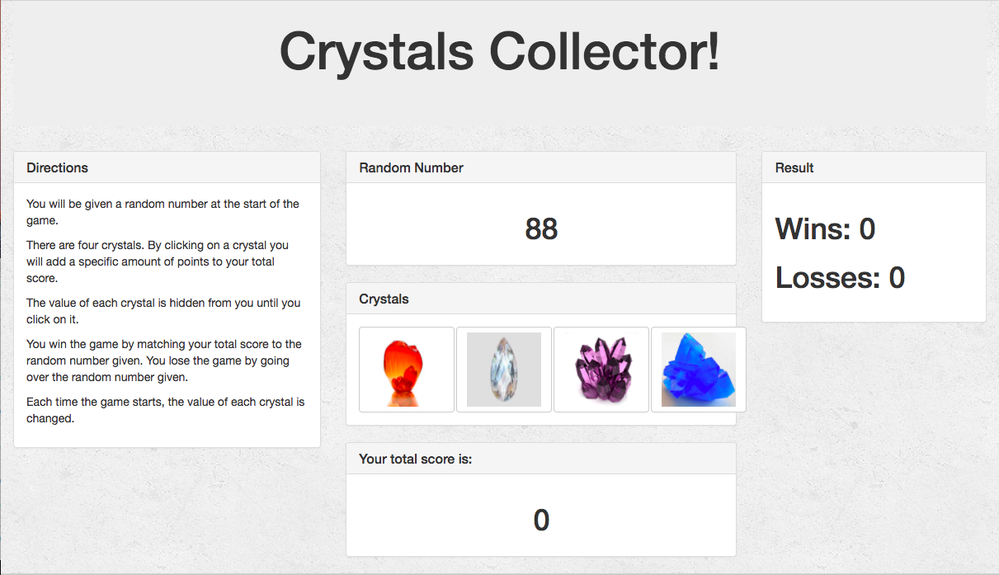

# Crystals Game Collector

### Directions
1. You will be given a random number at the start of the game.

2. There are four crystals.  By clicking on a crystal you will add a specific amount of points to your total score.
3. The value of each crystal is hidden from you until you click on it.
4.You win the game by matching your total score to the random number given.  You lose the game by going over the random number given.
5. Each time the game starts, the value of each crystal is changed.
